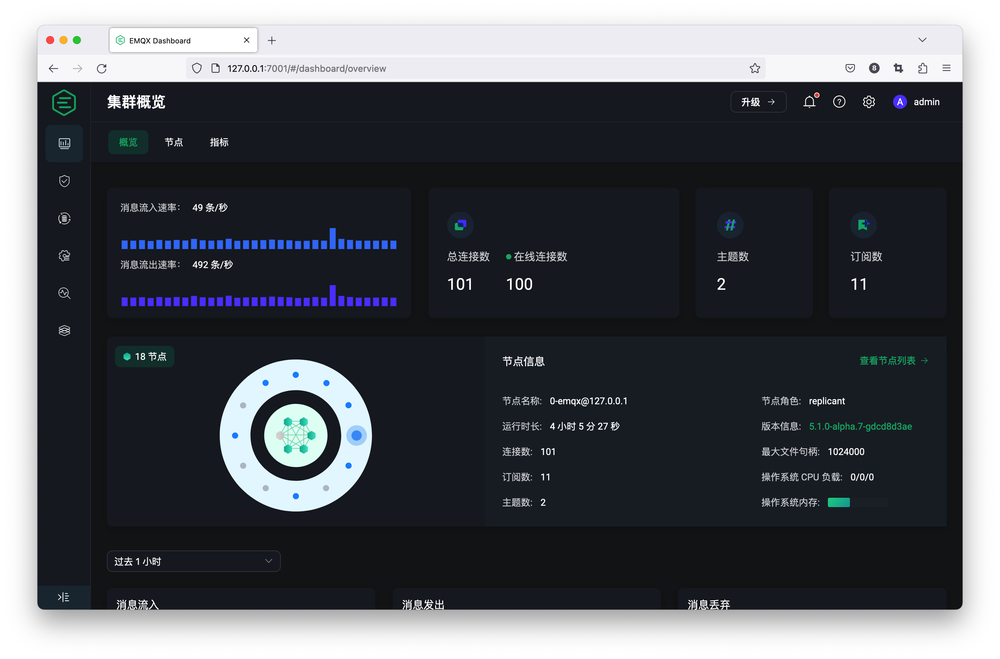
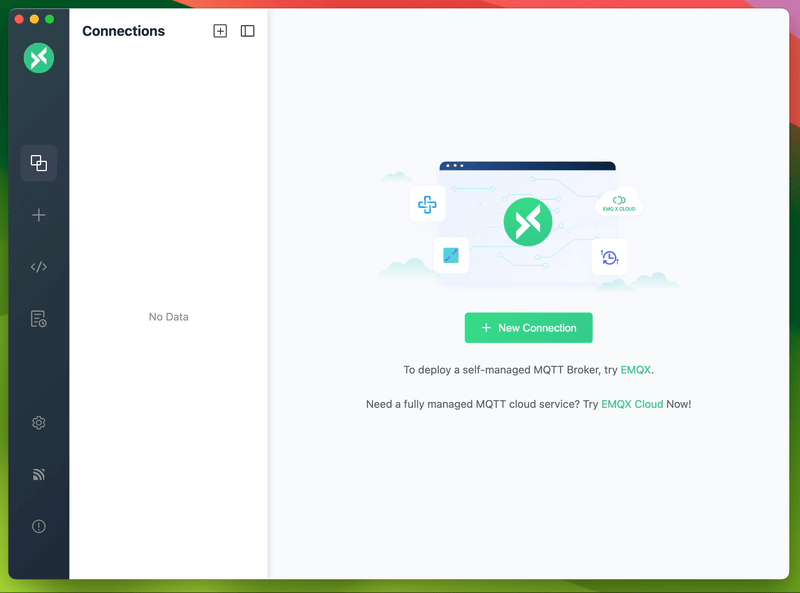

# MQTT

`time：2024-05-17`

## 缘由

对接大疆无人机，需使用mqtt接入无人机实时消息


## 简介

1. MQTT 是基于 Publish/Subscribe 模式的物联网通信协议
2. 包括三种角色： 发布者 （Publish）、代理（Broker）（服务器）、订阅者（Subscribe）。
3. MQTT传输的消息分为：主题（Topic）和负载（payload）两部分，其中的负载就是所要发送的内容。 

## 实现

### 代理（Broker）

#### EMQX 

EMQX概述：EMQX 是一款开源的大规模分布式 MQTT 消息服务器，功能丰富，专为物联网和实时通信应用而设计.支持多种协议，包括MQTT、HTTP、QUIC、WebSocket等.

EMQX Dashboard: EMQX 提供了一个内置的管理控制台，即 EMQX Dashboard。方便用户通过 Web 页面就能轻松管理和监控 EMQX 集群，并配置和使用所需的各项功能。




下载地址：https://www.emqx.io/zh/downloads?os=Windows

### 发布者 （Publish）

#### MQTTX

介绍：

集桌面应用、命令行工具与 Web 应用于一体的全功能 MQTT 客户端工具。



下载地址： https://mqttx.app/zh/downloads


### 订阅者（Subscribe）

#### 可以用MQTTX进行测试 这里使用java模拟客户端

#### pom.xml

```xml
...
        <dependency>
            <groupId>org.eclipse.paho</groupId>
            <artifactId>org.eclipse.paho.client.mqttv3</artifactId>
            <version>1.2.5</version>
             <!-- 根据最新版本选择 -->
        </dependency>
...
```

#### application.yml

```yml
mqtt:
  broker-url: ws://emqx@127.0.0.1:8083
  client-id: test123
  username: test1
  password: 123789
```

#### MqttConfig.java

```java
@Configuration
public class MqttConfig {

    @Value("${mqtt.broker-url}")
    private String brokerUrl;

    @Value("${mqtt.client-id}")
    private String clientId;

    @Value("${mqtt.username}")
    private String username;

    @Value("${mqtt.password}")
    private String password;
    @Autowired
    private MqttMessageHandler mqttMessageHandler;
    @Bean
    public MqttConnectOptions mqttConnectOptions() {
        MqttConnectOptions options = new MqttConnectOptions();
        options.setServerURIs(new String[]{brokerUrl});
        options.setUserName(username);
        options.setPassword(password.toCharArray());
        options.setAutomaticReconnect(true); // 设置自动重连
        return options;
    }

    @Bean
    public MqttClient mqttClient(MqttConnectOptions mqttConnectOptions) throws MqttException {
        try {
            MqttClient client = new MqttClient(brokerUrl, clientId);

                if (client.isConnected()) {
                    client.disconnect();
                    client.connect(mqttConnectOptions);
                    client.setCallback(mqttMessageHandler);
                    client.subscribe("your/topic");
                    return client;
                } else {

                    client.connect(mqttConnectOptions);
                    client.setCallback(mqttMessageHandler);
                    client.subscribe("your/topic");
                    return client;
                }

        } catch (MqttException e) {
            e.printStackTrace();
            throw e;
        }

    }
}
```

#### MqttMessageHandler.java

```java
@Component
public class MqttMessageHandler implements MqttCallback {

    private static final Logger LOGGER = LoggerFactory.getLogger(MqttMessageHandler.class);


    @Override
    public void connectionLost(Throwable cause) {
        LOGGER.error("MQTT连接已丢失", cause);
    }

    @Override
    public void messageArrived(String topic, MqttMessage message) throws Exception {
        String payload = new String(message.getPayload(), StandardCharsets.UTF_8);
        LOGGER.info("接收到MQTT消息: Topic={}, Message={}", topic, payload);

        // 这里可以处理实际的业务逻辑
        processMessage(topic, payload);
    }

    @Override
    public void deliveryComplete(IMqttDeliveryToken token) {
        // 消息发布完成的通知
    }

    private void processMessage(String topic, String message) {
        // 实际的消息处理逻辑
    }
}

```

#### TestController.java

```java
@RestController
@RequestMapping("/test")
public class TestController {

    @Resource
    private MqttClient mqttClient;

    @GetMapping("/test1")
    public String test1(){
        try {
            if(mqttClient.isConnected()){
                mqttClient.disconnect();
            }

        } catch (MqttException e) {
            e.printStackTrace();
        }
        return "success";
    }


    @GetMapping("/test2")
    public String test2(){
        try {
            if(mqttClient.isConnected()){
                MessageTestVo messageTestVo =new MessageTestVo();
                messageTestVo.setMsg("你好！");
                mqttClient.publish("testtopic", JSONUtil.toJsonStr(messageTestVo).getBytes(),0,false);
            }

        } catch (MqttException e) {
            e.printStackTrace();
        }
        return "success";
    }
}
```


