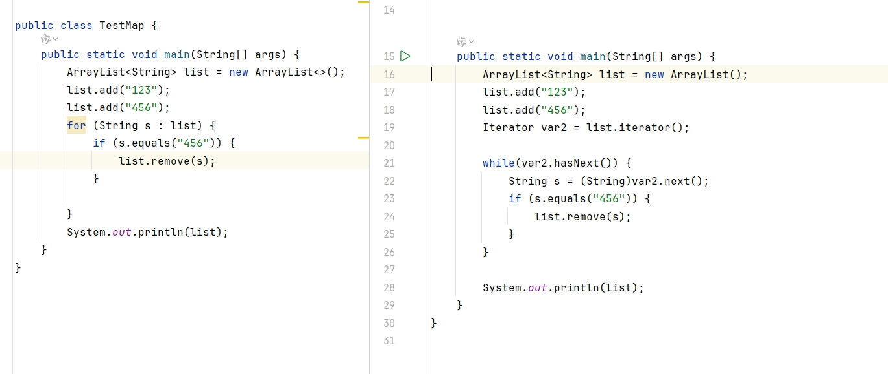

# arrarylist 不可以for-each遍历修改元素 

## 结果

会抛出ConcurrentModificationException异常

## 原理分析
1. for操作是java的语法糖，执行后用的是Iterator，这也是为什么要实现forEach的原因
   
    
   
2. 报错位置 modCount !=expectedModCount

### modcount
    1. modCount这个字段位于java.util.AbstractList抽象类中。
    2. modCount的注释中提到了"fail-fast"机制。
    3. 如果子类希望提供"fail-fast"机制，需要在add(int,E)方法和remove(int)方法中对这个字段进行处理。
    4. 从第三点我们知道了，在提供了"fail-fast"机制的容器中（比如ArrayList），除了文中示例的remove(Obj)方法会导致ConcurrentModificationException异常，add及其相关方法也会导致异常。
### expectedModCount

   expectedModCount是ArrayList中一个名叫Itr内部类的成员变量。
   它代表的含义是在这个迭代器中，预期的修改次数.

   expectedModCount什么时候发生变化?
   1. 情况一:当Itr初始化的时候，会对expectedModCount字段赋初始值，其值等于modCount。
   2. 情况二:调用Itr的remove方法后会再次把modCount的值赋给expectedModCount。
    换句话说就是：调用迭代器的remove会维护expectedModCount=modCount。

## 答案

由于ArrayList的"fail-fast"机制，调用remove方法会触发【modCount++】操作，对expectedModCount没有任何操作。只有调用迭代器的remove方法，才会维护expectedModCount=modCount。

所以调用了list的remove方法后，再调用Itr的next方法时，导致了expectedModCount！=modCount，抛出异常。

## 正确做法

1. Iterator
   
```java
        //删除第二个元素
        ArrayList<String> list2 = new ArrayList<>();
        list2.add("123");
        list2.add("456");

        Iterator<String> iterator = list2.iterator();
        while (iterator.hasNext()) {
            String next = iterator.next();
            if (next.equals("456")) {
                //使用iterator的remove方法
                iterator.remove();
            }
        }
```

1. JDK>=1.8，removeIf()

```java
        //删除第二个元素
        ArrayList<String> list1 = new ArrayList<>();
        list1.add("123");
        list1.add("456");
        //使用removeIf 方法
        list1.removeIf(s -> s.equals("456"));
```

3. CopyOnWriteArrayList

 ```java
        CopyOnWriteArrayList copyOnWriteArrayList =new CopyOnWriteArrayList();
        copyOnWriteArrayList.add("123");
        copyOnWriteArrayList.add("456");
        copyOnWriteArrayList.forEach(o -> {
            if (o.equals("456")) {
                copyOnWriteArrayList.remove(o);
            }
        });
 ```   