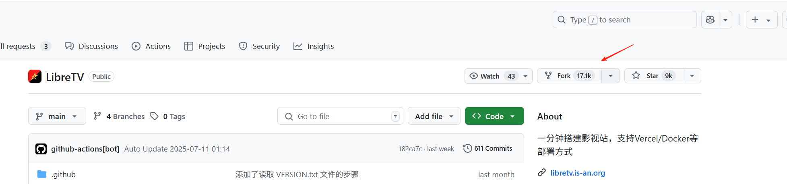
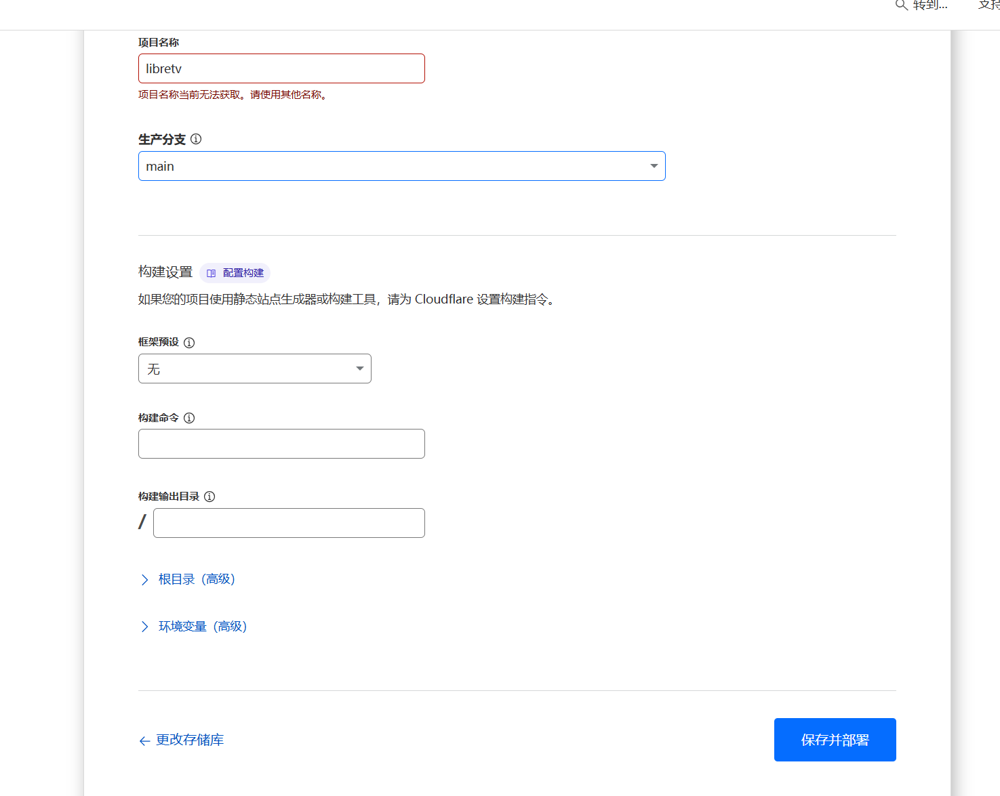
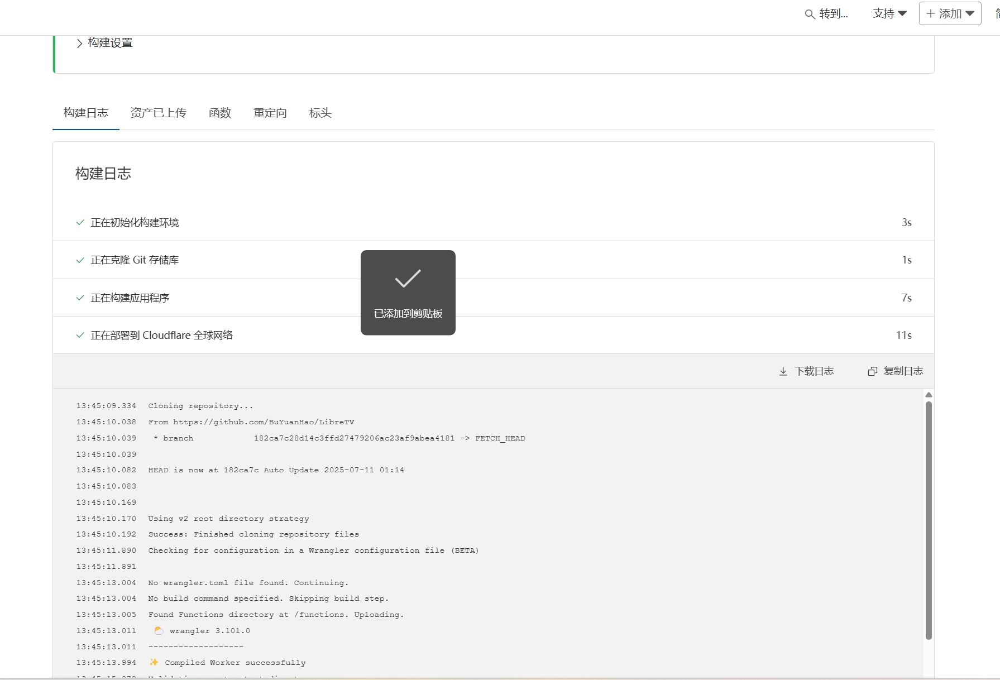

## Cloudflare

### 可以干嘛
1. 给网站加速（靠全球 CDN 节点）；
2. 防攻击（DDoS、黑客入侵等）；
3. 免费提供 SSL 证书，让网站加 HTTPS；
4. 部署轻量代码（Workers）和静态网站（Pages）；
5. 屏蔽垃圾流量、优化图片加载等。

### 特点

免费功能实用：提供免费 SSL 证书、基础 CDN、静态网站部署等，门槛低。

开发者友好：支持无服务器计算（Workers）、静态托管（Pages），方便快速部署应用。

### 注册

官网： https://dash.cloudflare.com

## 尝试在Cloudflare部署网站

### 寻找可以部署的项目

https://github.com/zhuima/awesome-cloudflare

### 确定项目

LibreTV：https://github.com/bestZwei/LibreTV

简介：LibreTV 是一个轻量级、免费的在线视频搜索与观看平台，提供来自多个视频源的内容搜索与播放服务。无需注册，即开即用，支持多种设备访问。项目结合了前端技术和后端代理功能，可部署在支持服务端功能的各类网站托管服务上

### 部署

1. fork LibreTV项目到自己的git仓库，避免它更新时自动更新我们自己的服务

 

2. 注册 Cloudflare 可以谷歌邮箱注册

   官网:  https://dash.cloudflare.com

3. 部署

    workers->pages->导入现有 Git 存储库->选择自己fork的仓库（第一次要登录github）->配置
 

 ->添加环境变量：PASSWORD（登录密码） ADMINPASSWORD（配置密码） 

 ->保存并部署

 ->成功
  

  ->访问
  https://libretv-4r8.pages.dev/

  

## 访问不了 需要挂梯子

安排！

### CloudflareSpeedTest

测试 Cloudflare CDN 延迟和速度，获取最快 IP

https://github.com/XIU2/CloudflareSpeedTest

下载压缩包,运行exe文件，更改host

C:\Windows\System32\drivers\etc

